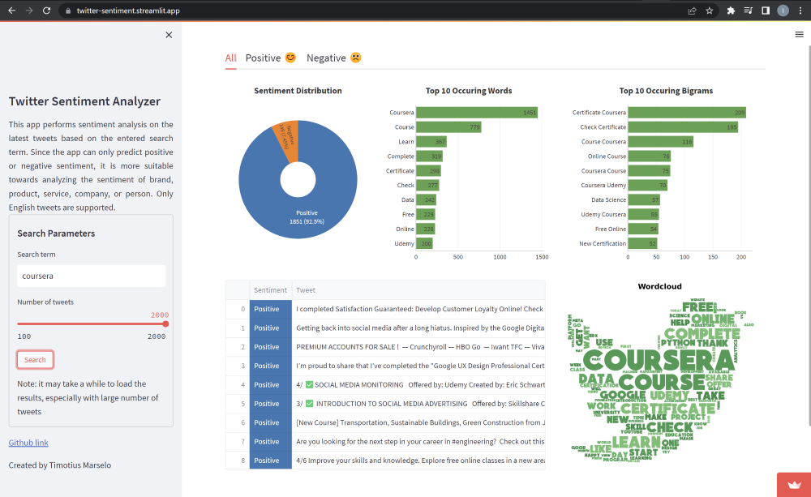
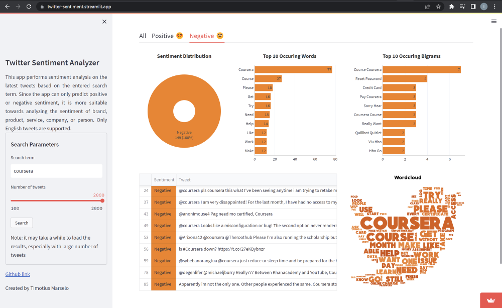
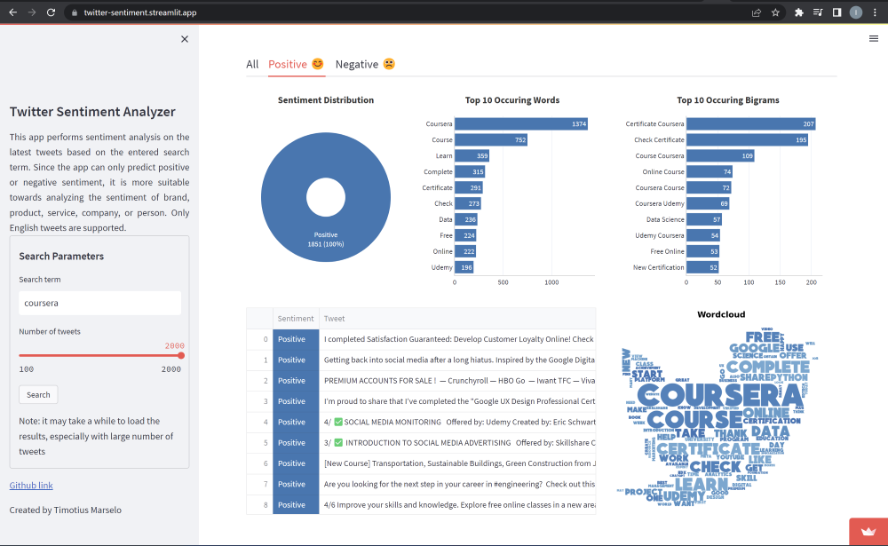

# End-to-End Machine Learning Project: Twitter Sentiment Analysis - Use Cases (Part 4)

In the previous three articles, we have explored the process of collecting data, training our model and making an online application that can display the sentiment of the latest tweets related to a search term. In this article, we will examine the potential use cases of sentiment analysis in business and social science. We will also demonstrate a real example using our sentiment analysis application.

### Sentiment Analysis for Business

Understanding the public's opinion is crucial for the success of any business, and Twitter is often used by the public to express their opinions or feedbacks on certain brands, services or products. However, reading through the vast volumes of tweets manually can be time-consuming and tedious, making it difficult for businesses to identify tweets that require immediate attention. Fortunately, automated sentiment analysis can provide a solution to this problem. By using machine learning algorithms to classify the sentiment of the tweets, businesses can quickly identify critical tweets and areas that need improvement. For example, a business may want to monitor negative tweets related to their brand, so they can leverage this information to improve customer satisfication.

In addition, businesses can also use sentiment analysis for other purposes. For example, if a business sees a surge in positive sentiment regarding a particular product, they may take advantage of this opportunity by creating content and promotion related to that product. Moreover, businesses can also use sentiment analysis to track the sentiment of their competitors. This allows businesses to stay informed on the current trends and adjust their strategies accordingly.

### Sentiment Analysis for Social Science

In the field of social science, sentiment analysis can be used to analyze public's opinion on various subjects such as social issues, public policies, political parties, or political events. By applying sentiment analysis, policymakers and researchers can better understand the public's attitude on particular topics and make informed decisions based on their findings. For example, policymakers might want to gauge the public's response to the newly released policies, so they can evaluate the impact of the new policies and take necessary actions. Moreover, sentiment analysis are often used to predict the election results.

### Demonstration: Sentiment Analysis for Tweets Related to Coursera

Coursera is an online learning platform that offers courses from various universities and organizations. In this section, let's imagine that we are the CEO of Coursera and would like to improve the overall experience of Coursera users. To achieve this, we will use our sentiment analysis application to analyze the sentiment of latest tweets related to Coursera.

Most of the tweets (92.5%) related to Coursera are classified as positive. This is a good sign, as it shows that the public's perception of Coursera is generally positive. However, there are also a few negative tweets, which probably require immediate attention. Let's take a closer look at the negative tweets.

Below are some examples of negative tweets related to Coursera:  
* **@coursera pls coursera this what I've been seeing anytime i am trying to retake my test..been days now i couldn't take my course challenge. https://t.co/fB5nIZIyMs**
* **@coursera I am very disappointed! For the last month, I have had no access to my course despite having paid and getting monthly deductions from you. My efforts to reach out to you for help have been futile with NO response from your end. I am not even able to CANCEL it!**
* @anonimouse4 Pag need mo certified, Coursera
* **@coursera Looks like a misconfiguration or bug! The second option never rendered.**
* **@Arixona12 @coursera @Theroothub Please I'm also running the scholarship but i haven't been able to collect certificate**
* **is #Coursera down? https://t.co/27eKBybnzr**
* @sybebanorangtua @coursera just reduce ur sleep time and be prepared for the back pain
* @degenlifer @michaeljburry Really??? Between Khanacademy and YouTube, Coursera, edx, you have all the information out there. But we still have colleges charging the highest fees. Why?
* **Apparently im not the only one. Other people experienced the same. Coursera stores your credit card info and keeps charging you without your notice. They still haven't got back to me. Do NOT use this website. #courserascam  @coursera https://t.co/rW6cReU7EF**
* **@coursera I really want my money back and this again is the third time https://t.co/ncx50xKMa0**

We can see some issues (bold tweets) regarding the user experience of the Coursera platform, such as payment issues or not being able to access the course challenge. The top bigrams also shows that some users are having issues related to resetting password and credit card. With the help of our sentiment analysis application, we can quickly identify these issues and take the necessary actions to improve the user experience. Note that although some tweets have been categorized as negative, they may not necessarily reflect a negative sentiment towards Coursera. Now let's take a look at the positive tweets.  

Below are some examples of positive tweets related to Coursera (spam tweets are excluded):  
* I completed Satisfaction Guaranteed: Develop Customer Loyalty Online! Check out my certificate https://t.co/23RLPLLcS9 #Coursera
* Getting back into social media after a long hiatus. Inspired by the Google Digital Marketing and E-commerce certification course I’m working on completing through #coursera https://t.co/K4Wz46DBGg https://t.co/BcUoSOmqSm
* I’m proud to share that I’ve completed the "Google UX Design Professional Certificate." It was a challenging but rewarding journey. I’m grateful to my instructors, Michael, Emily, Karen, Jason, Dave, Kunal, Paolo, and the whole Google UX team. https://t.co/QGRtZRiF1Q #Coursera
* Are you looking for the next step in your career in #engineering? Check out this cutting-edge #onlinecourse from @LeedsUniEng and learn how to manage the performance of major engineering projects! Start learning today on @coursera: https://t.co/JC4ZI6Wcbw https://t.co/fgj5FByKLC
* 4/6 Improve your skills and knowledge. Explore free online classes in a new areas of acting, business or writing &amp; stay on top of industry trends &amp; best practices  #Coursera is one online platform that offers free courses in different fields. #continuouslearning https://t.co/Xids5yiffa
* yeayy, my coursera course is finished!!!! gcsb im cominnn https://t.co/8pqWp0vexQ
* New Coursera survey shows high demand for industry micro-credentials from students and employers in tight labor market - Scott Shireman, Global Head of Coursera for Campus https://t.co/XBUuRqyRHZ
* Hi Guys, How reliable is #COURSERA ? Has anyone ever studied with them? I'm looking for a reliable and affordable online learning.
* View my verified achievement from @coursera. https://t.co/Roc8iEz8Mx
* Coursera, let's go :)

Many of the positive tweets are related users completing the courses on Coursera. In addition, we can also see some tweets promoting Coursera courses. Notice that unlike the negative tweets, none of the positive tweets above contain critical issues. So by using our sentiment analysis application, we can determine which tweets to address as a priority. 

Note: The current model can only classify tweet as positive or negative, so it is not able to handle neutral tweets (such as spam) properly.  

### Conclusion

In this post, we have explored how sentiment analysis can be applied in business and social science by providing valuable insights from the public. Additionally, we haved use our Streamlit applciation to demonstrate how businesses can use sentiment analysis to prioritze tweets that require immediate attention. Although some manual review may still be required, the use of sentiment analysis can help businesses to react more quickly.

### Relevant Links

* Project Github: <u>[github.com/tmtsmrsl/TwitterSentimentAnalyzer](https://github.com/tmtsmrsl/TwitterSentimentAnalyzer)</u>  
* Streamlit App: <u>[twitter-sentiment.streamlit.app/](https://twitter-sentiment.streamlit.app/)</u>
